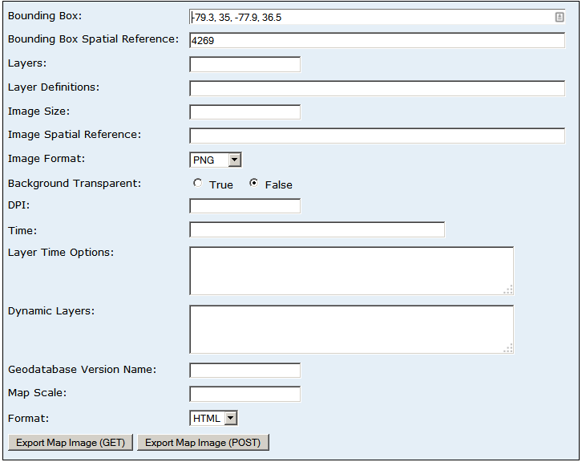

# Using APIs

In 2003 I attended an ESRI workshop at a Hyatt Hotel in downtown San Francisco. ESRI wanted to demonstrate some new powerful network server technology – their Internet Mapping System or [ArcIMS](http://en.wikipedia.org/wiki/ArcIMS). Their presentation flopped because the hotel’s network was not as fast as they had expected and drawing the data on screen was painfully slow. Using networked data was an interesting idea, but my takeaway was that it was always best to have all the resources you needed to get a spatial analysis done stored on the local desktop. 

Now, of course, high speed internet access is almost taken for granted. If you don’t have a smartphone, tablet, or ultraportable laptop with a data plan, then it’s likely that a free Wi-Fi hotspot is not too far away. And the data transfer speeds are far superior to what was available a decade ago. What was lacking in the ESRI presentation I attended years ago is now abundant, and what we see is a huge growth in web-enabled or “cloud-based” computing. 

The impact on spatial analysis is that we no longer need local copies of data on our machines to run analyses. Instead, we can simply connect to various data sources located on remote servers and query, clip, overlay, or mask these datasets directly. This offers the huge advantage of centralized management of these datasets; with everyone tapping into the same central dataset, you ensure that edits to the dataset are propagated to all users. It also makes doing spatial analyses on local machines much more lightweight since we don’t have to download entire datasets just to do analyses that require a small section of them.
In the past few years, however, servers have been going beyond just providing live links to data: they are now providing services. In other words, instead of using the tools contained in desktop ArcGIS we can use tools served up in the Cloud. If we want to calculate the average slope within a specified distance of certain streams, we can instruct a set of servers to find the elevation and stream data, to buffer the stream, calculate the slope with that buffered distance and report the average. All the processing is done on the server(s) hosting the service, meaning we don’t even need a beefy computer to get it done; a smart phone will do! 

In this tutorial we explore the application of web services to spatial analysis. It’s an exciting and rapidly evolving field: what’s “cutting edge” this year is likely to be old news the next. However, getting in on this technology at an early stage should provide you with a more robust understanding of how it works and thus how you can utilize its power most effectively. At this stage in the development of web services and cloud-based GIS, however, you’ll need to be prepared for bugs and limited documentation. It’s all part of the excitement of being at the forefront of technology. 

In this tutorial we begin simply, looking at web services from within web browsers. From there we explore how these services can be controlled via scripts (e.g. Python). Then we examine more advanced interfaces to web services, i.e. via APIs and applications that are integrated with web services (e.g. ArcGIS.com and Desktop ArcGIS). 


## Part 1. Exploring Web Services with a web browser

HTTP web services are programmatic ways of sending and receiving data from remote servers using the operations of HTTP directly. In its simplest form, it's a URL we send to our web browser that acts as a command, complete with arguments. 

#### An example:

To explain this concept better, try this: 

* Go to the NWIS web site that we used to download data for one of our first tutorials:
  http://waterdata.usgs.gov/nwis 
* Click on the **Current Conditions** button, then the **Build Current Conditions Table** link.
* Next, check **Site Number** and click **Submit**
* In the next page, enter the site number **02085070**, accept all the other defaults, and click the **Submit** button at the very bottom of the page.
* In the next page, click the link in the <u>Site Number</u> column of the table.
* In the next page, change 'Output Format' to <u>Tab-Separated</u> and 'Days' to **1**. Clear out the dates in the "Begin date" and "End date" boxes, then hit `GO`.

The result should be a text screen in your browser listing all data collected in the last 24 hours for site 02085070 - Eno River Near Durham. More importantly, take a look at the URL for the current page:

[http://waterdata.usgs.gov/nwis/uv?cb_00060=on&cb_00065=on&format=rdb&site_no=02085070&period=1&begin_date=&end_date=](http://waterdata.usgs.gov/nwis/uv?cb_00060=on&cb_00065=on&format=rdb&period=1&begin_date=&end_date=&site_no=02085070)

Edit this URL, changing the site_no to from 02085070 to 02087183. You'll see that the page now lists data for site 02087183 - Neuse River near Falls Lake, NC. 

***In other words, this URL is essentially a command string sent to the NWIS server with arguments embedded within it!*** 

Generally speaking arguments in a Web Service URL follow the '?' and are separated '&'. We can then parse this URL into the parts listed below. We can deduce what they might mean through some keen observation (e.g. look at the web page used to generate the URL), and perhaps through experimentation (i.e. change the values and see what happens). 

| component                      | meaning                                  |
| ------------------------------ | ---------------------------------------- |
| http://waterdata.usgs.gov/nwis | the web-service provider                 |
| uv                             | the service provided                     |
| cb_                            | 00060=on	include discharge data in the output |
| cb_                            | 00065=on	include gage height data in the output |
| format=rdb                     | list the output as a tab-separated       |
| period=1                       | days to include in the output table      |
| site_no=02085070               | the site number                          |


#### Other examples:

Another, more documented example of this can be seen in USGS web services hosted at the USGS’ Biodiversity Information Serving Our Nation (BISON), which provides its own API:
https://bison.usgs.gov/doc/api.jsp 

The BISON API provides a number of services and documents their parameters. For example, copy and paste their example URL in a browser: 

http://bison.usgs.gov/api/search.json?species=Bison%20bison&type=scientific_name&start=0&count=1

You see the result is in JSON format, and you can probably guess how you might edit this URL to return results for a different species. (Try “Cryptobranchus alleganiensis” – aka the hellbender). 

The web site documents various parameters you can invoke in the URL to filter the records returned. These include a filter for the county FIPS code. We can utilize this to return a set of record for a specific county, e.g. Durham (FIPS 37063)

Try this URL, which returns the first 10,000 records in Durham County. 
http://bison.usgs.gov/api/search.json?count=10000&countyFIPS=37063   

With some editing you could shape this data into a table which you could import into GIS…


### Using HTTP Services with Python and the `requests` module

Python allows us to programmatically extract data from web services such as the above NWIS and BISON examples using its `requests `module. This module works similarly to the `urllib` module (in fact it is built on top of it), bit it also includes a few features that facilitate using web services and APIs. 

I've created a few notebooks demonstrating these concepts. These are found in the `notebooks` folder. 

* `1-NWIS-discharge-data-as-API.ipynb` - This reveals a cleaner way to access the NWIS data, this time as a Web Service vs just an URL. When you've finished examining this example, have a look at the ArcMap document in the zipped Discharge workspace in this repository. It demonstrates how this can be used programmatically to display data in ArcMap. 

  ​

* `2-Exploring-the-BISON-API` - This explores a more formally presented API, i.e., the USGS's Biodiversity 


Information Serving Our Nation, or "BISON", API. This web service is a touch more complex than the NWIS service, but it is also more powerful. 


---


## Part 2. RESTful Web Services

The procedure of sending requests from client to server via URLs or web addresses actually has a formal name: **Re**presentational **S**tate **T**ransfer, or **REST**. While fancier attempts to convey information and objects across the web using HTTP have been used (e.g. SOAP and WSDL), REST’s approach of using simple text – sometimes taking the form of complex, but parse-able XML or JSON objects – has proven both simple and effective. 

- [ ] If you are curious, an excellent non-technical description of what REST is provided here: http://duke.edu/~jpfay/REST.html*. But really it’s just what we’ve been doing: sending commands to a server via a URL. 

      *this is a pilfer from Ryan Tomyko’s original post found [here](http://2ndscale.com/rtomayko/2004/rest-to-my-wife); please note why he took his original post down…

ESRI has fully embraced REST as a format for interacting with ArcGIS based web services and over the past few years (and versions of ArcGIS) has integrated more and more cloud-based technology into their software – much of it using REST-based we services. 

Let’s examine how these resources are put to use…


### ESRI REST-based web services

First, when searching for some on-line data or at some other point surfing the web you may have come across a web site that looks like this one: http://sampleserver1.arcgisonline.com/ArcGIS/rest/services. More and more of these sites are popping up. Here are just a few:

- http://services.nationalmap.gov/ArcGIS/rest/services
- http://gis.srh.noaa.gov/arcgis/rest/services
- http://tigerweb.geo.census.gov/arcgis/rest/services

What are all these sites?? Well, they are the end points to a vast amount of spatially enabled web services hosted using ESRI’s ArcGIS Server or its ArcGIS online technologies, and we can access these services using the REST interface. 

#### Exploring ESRI based web services

Let’s take a look at an example using a service I’ve created on a server hosted here in the Nicholas School: 
https://ns-win2012test.win.duke.edu/arcgis/rest/services

The services are organized as a series of folders. Click on the ENV859 folder and you’ll see few services available: 1 map servers and 2 geoprocessing server. The map servers serve data and the GPServers serve geoprocessing functionality. 

Click on the Discharge map server and you’ll see properties for this service. What I like to do first when investigating a map service is to look at the data. The fastest way to see the data is to click on the “View In: ArcGIS JavaScript” link. This opens a new window displaying the data using ArcGIS’s JavaScript API – an alternative to the Google Maps API (more info on that here).

This map service only serves one data layer: North Carolina HUCs, but it could provide many (e.g: 
https://tigerweb.geo.census.gov/arcgis/rest/services/TIGERweb/tigerWMS_Census2010/MapServer).

At the bottom of the map service page is a list of the supported operations on the service. Click the Export Map link. This is a (slightly clumsy) interface to build a custom request on these features. If you enter values into the blanks then hit “Export Map Image (GET)” it will send the request to the server using those parameters. It will also create the URL used to format that request. 

Try filling out the form like this (below) and the click “Export Map Image (GET)”
(the coordinates are -79.3, 35, -77.9, 36.5)



You’ll see an image zoomed to the Upper Neuse HUC. Also, in
the URL of the page created contains the REST format request, which can be
broken down as this:

```
https://ns-win2012test.win.duke.edu/
arcgis/rest/services/ENV859/Discharge/MapServer/export
?bbox=-79.3%2C+35%2C+-77.9%2C+36.5
&bboxSR=4269
&layers=
&layerDefs=
&size=
&imageSR=
&format=png
&transparent=false
&dpi=
&time=
&layerTimeOptions=
&dynamicLayers=
&gdbVersion=
&mapScale=
&f=html 
```

This URL is what we can manipulate to modify our request programmatically. To see what each of these parameters do, we consult the documentation on the ArcGIS Map Server REST API for the Export Map operation:
 http://resources.arcgis.com/en/help/arcgis-rest-api/index.html#/Export_Map/02r3000000v7000000/ 

Try editing the URL so that the output format is KMZ (change the last bit from &f=html to &f=KMZ -- <link>). You’ll see that it returns a Google Earth KMZ file. 

Try tweaking the URL so the output is in an image format (“&f=image”). It produces get a PNG format image of the layer clipped to the bound supplied in the bounding box. 

Lastly, for Layer Definitions enter: 0:HUC_NAME = 'Upper Neuse'. This instructs the server to, for the first layer (at index = 0), select features where the HUC_NAME = ‘Upper Neuse’ and only generate output for those features. 

In short, we have quite a powerful interface to spatial data. Time permitting, we will examine some interesting uses for these REST based services. Also, the document Tutorial 5.4 ESRI Services in GoogleMaps.pdf (on Sakai) demonstrates how these services can be incorporated into Google Maps. 